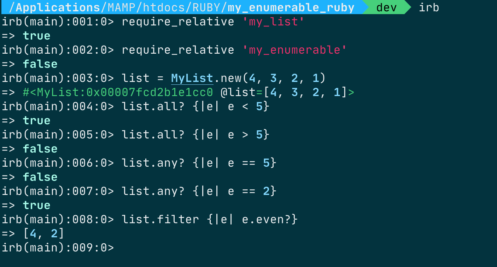

# Enumerable-app

- Create a class `MyList`.
- Create a module `MyEnumerable` to implement a subset of the functionality of [Enumerable](https://ruby-doc.org/core-3.0.0/Enumerable.html).

## Result from running the methods

# Built with

- Ruby

# Installation

Clone the repo and run `bundle install` in the command line to install the dependencies, then run `MyList.rb`

## Authors

👤 **Atugonza Joel Billions**

- GitHub: [@Billionsjoel](https://github.com/billionsjoel)
- LinkedIn: [@Billionsjoel](https://linkedin.com/in/billionsjoel)

# 🤝 Contributing

Feel free to check the [issues page](https://github.com/billionsjoel/enumerable-app/issues).